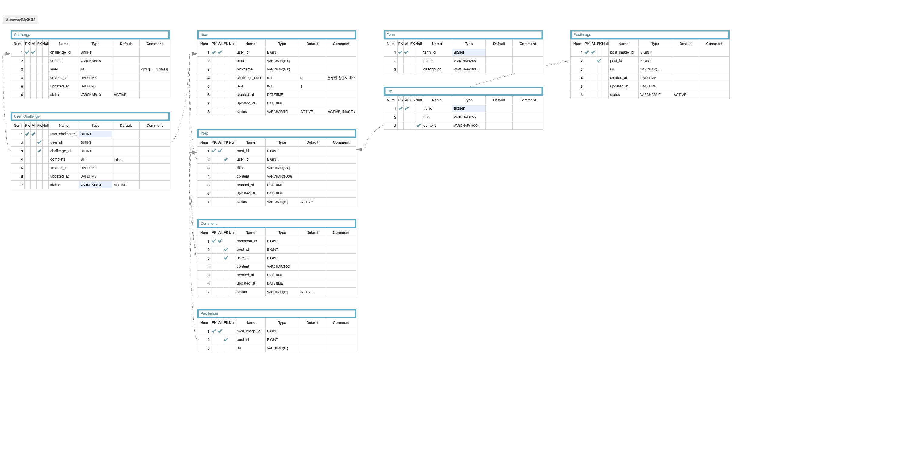

# Zeroway 🌱 

## 💡 프로젝트 소개
### 쓰레기 Zero! 탄소 Zero! 같이 걸어요 Zeroway! 
제로웨이스트를 위한 모바일 서비스, Zeroway의 프로젝트입니다.  

Zeroway는 제로웨이스트 실천을 위한 팁과 다양한 챌린지를 제공합니다.  
또한, 챌린지 달성도에 따라 레벨을 올리며 나만의 캐릭터를 키우면서 지속적인 실천을 장려합니다.

  

## 💡 구현 기능
### 1. 소셜 로그인

### 2. 오늘의 팁

### 3. 챌린지

### 4. 커뮤니티

  

## 💡 API 명세서
https://productive-garage-a90.notion.site/API-1703813db61a44f0b15bc802dd0778a4  
  

## 💡 ERD

 

## 💡 사용 기술 & 개발 환경 

### Server
- Java 11
- Spring Boot 2.7.1
- Gradle
- MySQL
- JDBC Template
- Spring Data JPA
- AWS RDS
- AWS Elastic beanstalk
- Intellij
 

### Android
- Kotlin 1.6.10
- Android 11
- Android Studio

  
